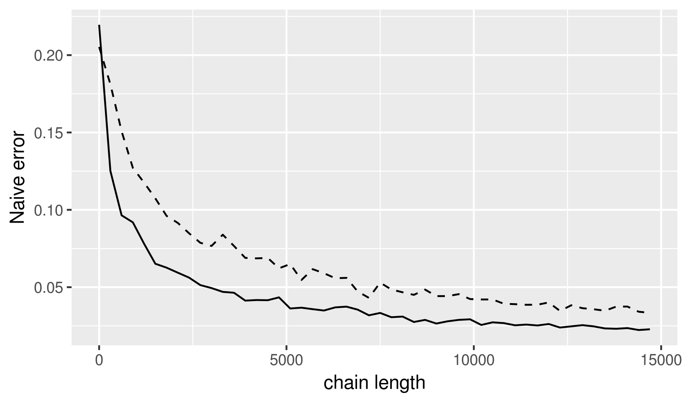

# In Search of a Bayesian Stopping Rule for Markov Chain Monte Carlo Simulation

## Introduction
 
Markov Chain Monte Carlo (MCMC) is an essential technique in estimating parameters of Bayesian models. 
Given a large enough sample size, MCMC simulation has been showed to converge to the 
true posterior distribution (Asmussen & Carlin, 2011). However, in practice, it's still difficult to determine
how large is a large enough sample size.
Many commonly used diagnostics and stopping rules for MCMC chains
tend to only focus on the stablization of the posterior mean estimates (Cowles & Glynn, 1996). 
In this project, we test different approaches to estimate the stablization of the whole posterior distribution with toy univariate and multivariate examples.
Specifically, we attempt to measure this "stablization" by:

+ Comparing the distributions of multiple MCMC samples using Kolmogorov-Smirnov test statistics in univariate case, and more general multivariate two sample tests in bivariate case.

+ Calculating batch mean standard error at multiple quantiles of a single MCMC sample, for both univariate and bivariate case.

+ Comparing the distributions of bootstrap resamples of a single MCMC sample using Kolmogorov-Smirnov test statistics for different univariate distributions.

## Simulation results

### Convergence of multiple samples

The idea behind this experiment is that two MCMC samples, starting at different (ideally overdispersed) intital conditions, will appear to be two samples drawn from the same distribution when they have both converged to the true posterior density. The Kolmogorov-Smirnov (KS) test statistics is an efficient measure to test the null hypothesis that two given samples are from the same distribution. This test is particularly useful in this context because it does not make any assumption about the underlying distribution. The p-value associated with this test statistics, however, is not useful because it's always very small when the sample size is large.

#### Univariate case

We run simulations on the following target distributions:

+ Normal: N(0,1)
+ Exponential: Exp(1)
+ Bimodal: of two overlapping normal distributions: X = 0.3N(1,1) + 0.7N(5,1)

and compare the stopping points given by the approach mentioned above, the Gelman-Rubin diagnostic (Gelman & Rubin, 1992; implemented in `coda`), and naive posterior mean standard error (Flegal & Jones, 2010; implemented in `mcmcse`).

The approach mentioned above is implemented as follows: Determine a desirable value for the KS statistics (in this experiment, we chose 0.05) which equates to how similar MCMC samples' CDF's are. Since KS statistics is between 0 and 1, one might establish a standardized cut off value across parameters of different scales. Four MCMC chains are ran, starting at points spread out across the proposal distributions. A KS statistic is calculated every 100 time steps between every two chains. The maximum KS statistics is then recorded.

Target | Normal                    | Exponential               | Bimodal
------:|:-------------------------:|:-------------------------:|:-----------------------------------:
KS test|  |   | 
CBM s.e.|  |   | 
GR |  |   | 

*Figure 1*: Visualization of different stopping rule statistics (KS test, consistent batch mean s.e. (CBM), and Gelman-Rubin diagnostic (GR)) at different time steps for three target distributions. Red dotted lines show approximately where the diagnostic would signal stopping MCMC chain

In general, KS statistics decreases as the sample size increases. Depending on the target distributions, sometimes the KS approach terminates the chains before or after the other standard approaches.

#### Bivariate case

We extend the above experiment to higher dimension using a bivariate normal whose dimensions are uncorrelated and one whose dimensions are correlated. We use three test statistics that are analogous to the KS test for multivariate samples:

+ Cramer test (Baringhaus & Franz, 2004; implemented in `cramer`)
+ Multivariate Smirnov test using Minimum Spanning Tree (Friedman & Rafsky, 1979; implemented in `GSAR`)
+ Wald-Wolfewitz test using Minimum Spanning Tree (Friedman & Rafsky, 1979; implemented in `GSAR`)

These test statistics prove to be computationally expensive to calculate. We use only two chains to calculate the statistics. The Cramer test starts taking a noticable amount of time to calculate statistics for sample size of more than 600, and RStudio crashes when the sample size is above 2000. The other two tests based on MST take even a longer to compute than the Cramer test so are eliminated early on from further experimentation. To at least have a proof of concept for our KS approach in multidimension, thinning is used to reduce the MCMC sample size. Only one sample is kept for every 20 samples. Only Cramer test is performed on the two chains. (Thinning makes the smaller samples approximately independent, which fits the i.i.d. assumption of Cramer test a little better.)

  Cramer test         |  CBM s.e.                |    Gelman-Rubin
:--------------------:|:------------------------:|:------------------------------
||

*Figure 2*: Visualization of different stopping rules stastistics for thinned MCMC chain at different time steps for a bivarate normal target distribution. In Cramer test, dashed line shows p-value; dotted line at 0 indicates the test fails to reject the null hypothesis that the samples are from the same distribution. In consistent batch mean s.e., solid line shows s.e. of first dimension; dashed line shows s.e. of the second dimension.

#### Discussion

Though the idea of using two sample test statistics to compare chains' distribution seem reasonable, it is currently not scalable to higher dimension examples. KS-like tests for multivariate examples don't result in intuitive behavior as chain gets longer. This is possibly due to the high variance caused by thinning. This direction can be further explored if there were other generalizations of KS test in higher dimension with efficient implementations. Another drawback of this approach is that running multiple chains is expensive if run sequentially since one can run one chain for twice as long and get a better estimate of the posterior density. However, parallel computing can be used to sample independent chains simulatneously at not much more computational cost [R-blogger](https://www.r-bloggers.com/post-10-multicore-parallelism-in-mcmc/).

### Reduction of standard error across quantiles

A common stopping rule is determining a level of accuracy and stop the chains whenever the batch mean standard error estimate is below this level. This standard error is usually calculated for the posterior mean, though there also exists methods to estimate standard error of user-specified quantile. Since we are interested in the convergence of the whole posterior density, we propose extending the above stopping rule to include standard error estimates of all quantiles. We implemented our idea as follows: Determine a desired level of accuracy specific to the application domain. Determine the quantiles at which s.e. of posterior estimate is calculated. For every 100 time steps, we calculate the s.e. for all quantiles determined in previous step and record the maximum s.e. MCMC chain can in theory be stopped after the maximum s.e. across the whole posterior estimate is below the accuracy level. Similar to the previous approach, we run simulations on the following target distributions:

+ Normal: N(0,1)
+ Exponential: Exp(1)
+ Bimodal: of two overlapping normal distributions: X = 0.3N(1,1) + 0.7N(5,1)

| Normal                    | Exponential               | Bimodal                             |
|:-------------------------:|:-------------------------:|:-----------------------------------:|
|  |   |  |

*Figure 3*: Comparison between maximum CBM s.e. at different quantiles (red) and CBM of the mean (blue) for different target distributions.

As seen in Figure 3, the maximum s.e. across all quantile is always larger than that of the mean. Thus, monitoring s.e. of the mean alone might lead to premature termination of MCMC simulations. Calculating the standard error for every quantiles is computationally intensive. For a simple normal toy example, we need to check 1000 quantiles to get a good--stable across different runs of the experiments--estimate of the maximum standard error across quantiles. Depending on the problem, we might need to check an even bigger number of quantiles to ensure the resulting maximum s.e. curve is replicable. 

|                                           |                                                |
|:-----------------------------------------:|:-----------------------------------------------|
| | |

*Figure 4*: Left plot: Visualization of CBM s.e. at different quantiles for a MCMC sample of size 4000 approximating a normal target distribution. Right plot: Maximum CBM s.e. at different quantiles as sample size increases (red) and the quantile of the maximum CBM s.e. (blue).

However, notice in Figure 4 that the maximum s.e. tend to belong to a small region of quantile, for instance the first quantile in the normal example. We plan to experiment with an adaptive scheme--checking more quantiles where the s.e. estimates are large--to reduce the amount of computation.

In addition, one might standardize the level of accuracy across parameters of different scaltes by using a relative fixed-width s.e. (Flegal & Gong, 2015) instead of a consistent batch mean s.e. Implementation of this mcmc s.e. estimate for the mean and quantiles doesn't exist yet to my knowledge. Similarly, an s.e. estimate that accounts for auto-correlation between dimensions can further improve quality of our stopping rule.

### Variation among bootstrap resamples

Instead of running multiple chains and comparing them with KS test, we experiment with taking bootstrap resamples of a single chain and calculating a KS statistics between every pair for every 100 time steps. The maximum KS statisitics is recorded. Since all the resamples are drawn from the same distribution, the KS test ends up saying that all our bootstrap resamples have the same underlying distribution. Nevertheless, the KS test statistics decreases as the MCMC sample size increases. However, since this test also relies on the KS test, it would not be scalable for multivariate case.

|          |          |
|:--------:|:--------:|
| |  |

*Figure 5*: Left plot: Visualization of the target distribution (solid red) and 1000 bootstrap resamples of a chain of size 1000 (dashed blue). Right plot: Comparison between maximum KS statistics between the original chain and each resample (red), between resamples (green), and consistent batch mean s.e. (blue).

## References

Asmussen, S., Glynn, P. (2011). A new proof of convergence of MCMC via the ergodic theorem, *Statistics & Probability Letters, Volume 81, Issue 10*, 1482-1485. https://doi.org/10.1016/j.spl.2011.05.004.

Baringhaus, L., Franz, C. (2004). On a new multivariate two-sample test, *Journal of Multivariate Analysis*, Volume 88, Issue 1, 190-206. https://doi.org/10.1016/S0047-259X(03)00079-4.

Cowles, M., Carlin, B. (1996). Markov Chain Monte Carlo Convergence Diagnostics: A Comparative Review. *Journal of the American Statistical Association, 91*(434), 883-904. doi:10.2307/2291683

Flegal, J. M., Gong, L. (2015). Relative fixed-width stopping rules for Markov Chain Monte Carlo simulation. *Statistica Sinica 25*, 655-675. doi:http://dx.doi.org/10.5705/ss.2013.209

Flegal, J. M., Jones, G. L. (2010) Batch means and spectral variance estimators in Markov chain
Monte Carlo. *The Annals of Statistics*, 38, 1034–1070.

Friedman, J., Rafsky, L. (1979). Multivariate Generalizations of the Wald-Wolfowitz and Smirnov Two-Sample Tests. *Ann. Statist.* 7, no. 4, 697--717. doi:10.1214/aos/1176344722.

Gelman, A., Rubin, D. (1992). Inference from Iterative Simulation Using Multiple Sequences. *Statist. Sci.* 7, no. 4, 457--472. doi:10.1214/ss/1177011136.

